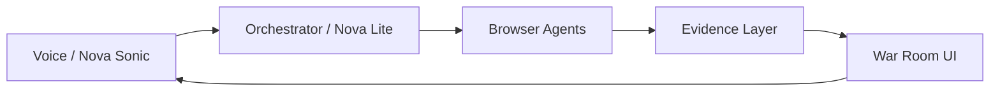

# VoiceAI — Mission Control (Dispatch)

A **voice-driven AI intelligence command center** powered by AWS Amazon Nova: speak a mission objective, and the system coordinates browser agents to gather evidence, synthesize findings, and stream results to a War Room UI.

**Status:** All 68 engineering tasks complete. See [tasks.md](tasks.md) for details.

---

## Architecture (high level)



Voice input drives the orchestrator; the orchestrator deploys agents; agents emit evidence; evidence is scored, stored, and streamed to the frontend.

---

## Prerequisites

| Tool       | Minimum | Notes |
|-----------|---------|--------|
| Python    | 3.12+   | [python.org](https://www.python.org/downloads/) or `brew install python@3.12` |
| Node.js   | 20+     | [nodejs.org](https://nodejs.org/) or `brew install node` |
| Docker    | Recent  | For Redis, Postgres, MinIO — [docker.com](https://www.docker.com/products/docker-desktop) |
| AWS CLI   | 2.x     | For Bedrock and secrets — [AWS CLI install](https://docs.aws.amazon.com/cli/latest/userguide/getting-started-install.html) |
| Git       | Recent  | Pre-installed on macOS; `brew install git` if needed |

---

## Directory layout

```
VoiceAI/
├── tasks.md           # Full system engineering plan (68/68 tasks complete)
├── CLAUDE.md          # Getting started and repo structure
├── team-tasks/        # Per-engineer task files
├── backend/           # FastAPI backend (missions, evidence, orchestrator, synthesis, gateway)
├── frontend/          # React + Vite War Room UI
├── agents/            # Browser agent system (pool, lifecycle, prompts)
├── infra/             # AWS CDK stacks (VPC, ECS, Redis, RDS, S3, OpenSearch, IAM, Dashboards)
├── demo/              # Demo scripts, mock evidence, load tests
└── docs/              # ENV, EVENTS, IAM, LOGGING, DEMO, VOICE_FORMAT, architecture
```

See [CLAUDE.md](CLAUDE.md) for the full repository structure and file-by-file description.

---

## Quick start

1. **Clone and branch**
   ```bash
   git clone <repo-url>
   cd VoiceAI
   git checkout -b <your-name>/setup
   ```

2. **Environment**
   Copy `.env.example` to `.env` and set `NOVA_API_KEY` (required for all model clients), `AWS_REGION`, and `AWS_PROFILE`. See [docs/ENV.md](docs/ENV.md) for the full variable reference.

3. **Local services**  
   Start Redis, Postgres, and MinIO:
   ```bash
   docker compose up -d
   ```

4. **Backend**  
   From repo root (after Task 1.2):
   ```bash
   cd backend && pip install -e ".[dev]" && uvicorn main:app --reload --port 8000
   ```

5. **Frontend**  
   In another terminal (after Task 1.2):
   ```bash
   cd frontend && npm install && npm run dev
   ```

For detailed setup, AWS Bedrock access, and demo mode, see **[CLAUDE.md](CLAUDE.md)**.

---

## Documentation

| Doc | Description |
|-----|-------------|
| [docs/ENV.md](docs/ENV.md) | Environment variable reference |
| [docs/EVENTS.md](docs/EVENTS.md) | Redis pub/sub event types and payloads |
| [docs/IAM.md](docs/IAM.md) | AWS IAM roles and permissions |
| [docs/LOGGING.md](docs/LOGGING.md) | Structured logging standard |
| [docs/DEMO.md](docs/DEMO.md) | Demo mode guide |
| [docs/VOICE_FORMAT.md](docs/VOICE_FORMAT.md) | Audio format specification |
| [docs/FRONTEND_STREAMING.md](docs/FRONTEND_STREAMING.md) | Frontend WebSocket streaming architecture |
| [docs/architecture.mmd](docs/architecture.mmd) | Mermaid system architecture diagram |

---

## Links

- **[tasks.md](tasks.md)** — Full engineering plan and phases
- **[CLAUDE.md](CLAUDE.md)** — Single source of truth for setup and repo structure
- **[team-tasks/](team-tasks/)** — Individual task files (bharath-gera, manav-parikh, rahil-singhi, chinmay-shringi, sariya-rizwan)
