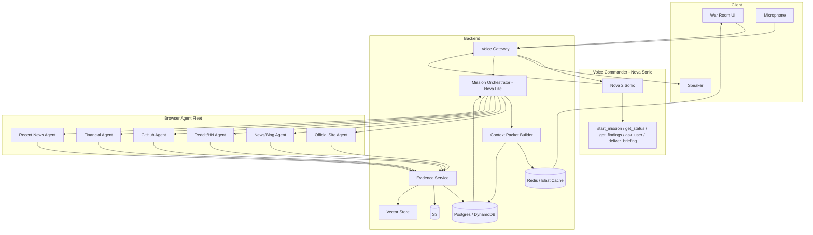

# Mission Control (Dispatch) — Engineering Task Plan

---

## Implementation Progress

**Last updated:** March 2026 — Session 3

| Phase | Tasks | Status | Owner |
|-------|-------|--------|-------|
| Phase 1 — Project Init | 1.1 Scaffold, 1.2 Deps, 1.3 Env Config, 1.4 CI | ✅ All Done | Bharath |
| Phase 1 — War Room UI | 8.1 Scaffold, 8.2 Layout, 8.3 Voice Panel, 8.4 Agent Grid, 8.5 Evidence Board, 8.6 Timeline | ✅ All Done | Sariya |
| Phase 1 — Frontend State | 9.3 Zustand store + TypeScript types | ✅ Done | Sariya |
| Phase 1 — WebSocket Hook | 8.7 WS hook (reconnection logic) | 🔄 Placeholder — needs live backend | Sariya |
| Phase 2 — AWS Infra | 2.1–2.5 VPC/ECS/Redis/Postgres/S3/OpenSearch, 2.6 IAM, 2.7 Docker Compose | ⏳ Pending | Manav / Bharath |
| Phase 3 — Voice Gateway | 3.1 Sonic client ✅, 3.2 Tool schemas ✅, 3.3 WS gateway, 3.4 VAD, 3.5 barge-in | 🔄 2/5 Done | Chinmay |
| Phase 4 — Orchestrator | 4.4 Nova Lite client ✅, 4.1 State machine, 4.2 CRUD API, 4.3 context builder, 4.5 planning loop | 🔄 1/5 Done | Manav |
| Phase 5 — Browser Agents | 5.1–5.5 Session manager, pool, prompts, evidence emission, lifecycle | ⏳ Pending | Chinmay |
| Phase 6 — Evidence | 6.1–6.4 Schema, storage, scoring, list API | ⏳ Pending | Rahil |
| Phase 7 — Vectors | 7.1–7.5 Embeddings, pipeline, clustering, themes, contradiction detection | ⏳ Pending | Rahil |
| Phase 8 — WS Streaming | 9.1 Redis channels, 9.2 WS relay, 9.4 Backpressure | ⏳ Pending | Manav / Sariya |
| Phase 9 — Agent Orch. | 10.1–10.5 Decomp, graph, assignment, realloc, stopping | ⏳ Pending | Chinmay / Rahil |
| Phase 10 — Commands | 11.1–11.4 Command protocol, watchdog, parallel dispatch, aggregation | ⏳ Pending | Chinmay / Rahil |
| Phase 11 — Synthesis | 12.1–12.3 Clustering, briefing prompt, spoken delivery | ⏳ Pending | Rahil |
| Phase 12 — Observability | 13.1–13.5 Logging, metrics, dashboards, tracing, DLQ | ⏳ Pending | Bharath / Manav / Sariya |
| Phase 13 — Demo | 14.1–14.5 Demo script, mock mode, reset endpoint, diagram, load test | ⏳ Pending | Bharath |

### What Is Live Right Now

```
models/
  __init__.py         Package init — exports LiteClient, SonicClient, SonicEvent, SONIC_TOOLS
  lite_client.py      Nova 2 Lite client via Nova API (api.nova.amazon.com)
                        chat(), stream_chat(), plan_tasks(), plan_next_actions(),
                        synthesize_briefing() — smoke-tested live ✅
  sonic_client.py     Nova 2 Sonic real-time WebSocket client
                        SonicClient.connect(), SonicSession.send_audio/text/tool_result,
                        stream_events() → SonicEvent, silence keepalive, interrupt()
                        — smoke-tested live, 184KB audio received ✅
  sonic_tools.py      5 tool schemas: start_mission, get_mission_status, get_new_findings,
                        ask_user_for_clarification, deliver_final_briefing
                        SONIC_TOOLS (Nova Realtime format) + SONIC_TOOLS_BEDROCK (fallback) ✅

backend/
  main.py             GET /health → {"status": "ok"}
  config.py           Settings (pydantic-settings, reads .env) — incl. nova_api_key
  pyproject.toml      13 runtime deps (added openai, tenacity, websockets)
  tests/
    test_smoke.py     async health check — passing

frontend/
  src/
    types/api.ts              TypeScript interfaces (all schemas)
    store/index.ts            Zustand store (seeded with Sequoia demo data)
    hooks/useWebSocket.ts     WS hook with exponential-backoff reconnection
    components/
      layout/
        WarRoomLayout.tsx     Full-screen CSS grid war room
        Header.tsx            Mission objective, status badge, connection dot
      StatusBadge.tsx         Color-coded IDLE/ASSIGNED/BROWSING/REPORTING pill
      AgentTile.tsx           Agent card with scanning animation
      AgentGrid.tsx           2-col grid of 6 agent tiles
      EvidenceCard.tsx        Card with confidence meter, theme pill, source link
      EvidenceBoard.tsx       Scrollable board with theme filter pills
      MissionTimeline.tsx     Chronological event log with lucide-react icons
      VoicePanel.tsx          Mic toggle, 60fps waveform, transcript feed

.github/workflows/ci.yml     4 parallel jobs (lint + test for backend + frontend)
.env.example                 14 placeholder env vars (incl. NOVA_API_KEY)
docs/ENV.md                  Full variable reference
```

---

## System Overview

Mission Control is a voice-driven AI command center that deploys a fleet of autonomous browser agents in parallel to investigate complex questions and synthesize real-time intelligence. A user speaks a mission request; the system interprets it, decomposes it into sub-tasks, deploys multiple browser agents (Amazon Nova Act / AgentCore Browser), collects evidence into a shared layer, clusters findings via embeddings, dynamically reallocates agents, narrates progress via Amazon Nova 2 Sonic, and produces a final synthesized briefing. The orchestrator (Amazon Nova 2 Lite) never holds full conversation history—it receives a structured Mission Context Packet. The demo targets sub-second voice response, sub-8s first evidence, and sub-45s final briefing.

---

## System Architecture Diagram



---

## Latency Targets

| Metric | Target | Notes |
|--------|--------|------|
| User speaks → Sonic first response | < 1 s | Immediate acknowledgement |
| Mission start → agents launched | < 3 s | Parallel deployment |
| Mission start → first evidence | < 8 s | At least one agent yields finding |
| Mission start → final spoken briefing | < 45 s | End-to-end demo |

---

## Data Schemas

### MissionRecord

| Field | Type | Description |
|-------|------|-------------|
| `id` | UUID | Primary key |
| `objective` | string | User-stated mission (e.g. "Pitch to Sequoia...") |
| `status` | enum | `PENDING` \| `ACTIVE` \| `SYNTHESIZING` \| `COMPLETE` \| `FAILED` |
| `task_graph` | JSON/JSONB | Serialized task graph (nodes + edges) |
| `agent_ids` | string[] | IDs of agents assigned to this mission |
| `created_at` | timestamp | Creation time |
| `updated_at` | timestamp | Last state change |
| `briefing` | text | Final synthesized briefing (when COMPLETE) |
| `briefing_audio_s3_key` | string? | Optional TTS output for replay |
| `user_id` | string? | Optional for multi-tenant |

### TaskNode

| Field | Type | Description |
|-------|------|-------------|
| `id` | UUID | Task identifier |
| `mission_id` | UUID | Parent mission |
| `description` | string | Human-readable objective for this task |
| `agent_type` | enum | `OFFICIAL_SITE` \| `NEWS_BLOG` \| `REDDIT_HN` \| `GITHUB` \| `FINANCIAL` \| `RECENT_NEWS` |
| `status` | enum | `PENDING` \| `ASSIGNED` \| `IN_PROGRESS` \| `DONE` \| `CANCELLED` |
| `dependencies` | UUID[] | Task IDs that must complete first (optional DAG) |
| `assigned_agent_id` | string? | Agent currently handling this task |
| `priority` | int | Higher = sooner assignment |
| `created_at` | timestamp | |

### EvidenceRecord

| Field | Type | Description |
|-------|------|-------------|
| `id` | UUID | Primary key |
| `mission_id` | UUID | Parent mission |
| `agent_id` | string | Emitting agent |
| `claim` | string | Short factual claim (e.g. "Sequoia led Series A in X") |
| `summary` | string | 1–2 sentence summary |
| `source_url` | string | Canonical URL |
| `snippet` | text | Raw extracted text |
| `screenshot_s3_key` | string? | S3 key for screenshot image |
| `confidence` | float | 0.0–1.0 |
| `novelty` | float | 0.0–1.0 (1 = highly novel vs existing evidence) |
| `theme` | string? | Cluster/theme label |
| `embedding_id` | string? | Reference to vector store document ID |
| `timestamp` | timestamp | When evidence was emitted |

### AgentCommand

| Field | Type | Description |
|-------|------|-------------|
| `command_type` | enum | `ASSIGN` \| `REDIRECT` \| `STOP` |
| `agent_id` | string | Target agent |
| `task_id` | UUID? | For ASSIGN: task to execute |
| `objective` | string | Natural language objective |
| `constraints` | object? | Optional: max_depth, allowed_domains, time_limit_sec |

### MissionContextPacket

Sent to Nova Lite each planning cycle. Never includes full conversation history.

| Field | Type | Description |
|-------|------|-------------|
| `mission_id` | UUID | |
| `objective` | string | Mission objective |
| `active_agents` | array | `{ agent_id, task_id, status, last_heartbeat }` |
| `fleet_status` | string | Aggregate: e.g. "4 active, 2 idle" |
| `top_findings` | array | Top N evidence summaries (by confidence/novelty) |
| `contradictions` | array | Pairs of evidence IDs or claims that conflict |
| `open_questions` | array | Unresolved sub-questions |
| `conversation_summary` | string | 1–2 sentence summary of last user/orchestrator exchange |
| `evidence_count` | int | Total evidence so far |
| `time_elapsed_sec` | float | Since mission start |

---

## API Contracts

### REST

| Method | Path | Description | Request Body | Response |
|--------|------|-------------|--------------|----------|
| POST | `/missions` | Create mission (orchestrator may call after `start_mission` tool) | `{ "objective": string }` | `{ "id": UUID, "status": "PENDING", ... }` |
| GET | `/missions/{id}` | Get mission + task graph + latest evidence count | — | `MissionRecord` + optional `tasks[]`, `evidence_count` |
| PATCH | `/missions/{id}` | Update status, attach briefing | `{ "status"?, "briefing"? }` | Updated `MissionRecord` |
| GET | `/missions/{id}/evidence` | Paginated evidence | `?limit=20&offset=0&theme=` | `{ "items": EvidenceRecord[], "total": int }` |
| GET | `/missions/{id}/tasks` | Task list for mission | — | `TaskNode[]` |
| POST | `/evidence` | Ingest evidence (called by agent runtime) | `EvidenceRecord` (without id) | `{ "id": UUID }` |
| GET | `/agents` | List agents (for fleet display) | — | `{ "agents": { id, status, current_task_id?, site_url? }[] }` |
| POST | `/demo/reset` | Reset demo state (Phase 14) | — | `204 No Content` |

### WebSocket (Client ↔ Backend)

**Endpoint:** `wss://<backend>/ws/mission/{mission_id}` or `wss://<backend>/ws/voice`

**Message formats (server → client):**

| Type | Payload | Description |
|------|---------|-------------|
| `AGENT_UPDATE` | `{ agent_id, status, task_id?, objective?, site_url?, screenshot_url? }` | Agent state change |
| `EVIDENCE_FOUND` | `{ evidence: EvidenceRecord }` | New evidence card |
| `MISSION_STATUS` | `{ mission_id, status, evidence_count, active_agents }` | Mission state |
| `VOICE_TRANSCRIPT` | `{ role: "user"|"assistant", text, is_final?: boolean }` | Live transcript |
| `BRIEFING_CHUNK` | `{ text, done?: boolean }` | Streaming final briefing |
| `TIMELINE_EVENT` | `{ event_type, payload, ts }` | Mission timeline entry |
| `ERROR` | `{ code, message }` | Error to display |

**Client → server (voice WebSocket):** Binary audio chunks (e.g. PCM 16-bit 16 kHz) or JSON control messages `{ "type": "start"|"stop"|"interrupt" }`.

---

## Deployment Topology

- **Frontend:** Static assets (React/Vite) served via S3 + CloudFront or Netlify/Vercel.
- **Voice Gateway + Orchestrator + Evidence API:** Single FastAPI app or split into services; run on ECS Fargate behind ALB, or Lambda + API Gateway for serverless. Prefer Fargate for long-lived WebSocket connections.
- **Redis (ElastiCache):** Mission hot state, agent heartbeats, pub/sub for real-time events. Cluster mode optional; single node sufficient for demo.
- **Postgres (RDS) or DynamoDB:** Missions, tasks, evidence metadata. Use RDS for relational queries (tasks by mission, evidence by theme); DynamoDB for scale and single-table design.
- **S3:** Screenshots, raw extracts, browser artifacts. Lifecycle policy to expire or archive after 7–30 days.
- **Vector store (OpenSearch Serverless or Bedrock Knowledge Base):** k-NN index for evidence embeddings. Nova Multimodal Embeddings output dimension must match index.
- **Agents:** Browser agent workers can run in same Fargate task pool as orchestrator (same VPC) or as separate worker service subscribing to Redis commands.

---

## Failure Handling Strategies

| Failure | Strategy |
|---------|----------|
| Sonic timeout / Bedrock throttling | Retry with exponential backoff; return fallback phrase ("Checking on that...") |
| Orchestrator planning timeout | Use last known good context packet; retry once; else mark mission DEGRADED and continue with existing agents |
| Agent crash or no heartbeat | Orchestrator marks task unassigned; reassign to idle agent or spawn replacement |
| Evidence ingest failure | Write to DLQ; log; optional retry from agent |
| Redis unavailable | Degrade to polling from DB for mission status; disable real-time push |
| Vector index failure | Evidence still stored in DB; clustering/synthesis uses keyword or no clustering |
| User disconnect (WebSocket close) | Mission continues server-side; client can reconnect and GET mission state |

---

## Observability Metrics

| Metric | Type | Labels | Use |
|--------|------|--------|-----|
| `mission_start_total` | Counter | — | Missions created |
| `mission_duration_seconds` | Histogram | status | Time to COMPLETE/FAILED |
| `agent_task_duration_seconds` | Histogram | agent_type | Per-agent task latency |
| `evidence_ingested_total` | Counter | mission_id | Evidence rate |
| `sonic_first_token_seconds` | Histogram | — | Voice TTFB |
| `orchestrator_planning_duration_seconds` | Histogram | — | Context build + Lite call |
| `websocket_connections_active` | Gauge | — | Connected clients |
| `agent_heartbeat_missed_total` | Counter | agent_id | Watchdog triggers |

---

# Implementation Phases

---

## Phase 1 — Project Initialization

### Task 1.1 — Monorepo scaffold

**Description:** Create root directory structure and placeholder files for `frontend/`, `backend/`, `agents/`, `models/`, `infra/`. No business logic yet.

**Technical notes:**
- Root: `README.md`, `.gitignore` (Python, Node, env, IDE), `tasks.md` (this file).
- `frontend/`: reserved for War Room UI (Phase 8).
- `backend/`: FastAPI app entrypoint placeholder, `backend/requirements.txt` or `pyproject.toml`.
- `agents/`: subdirs per agent type optional (e.g. `agents/prompts/`, `agents/browser_runner.py`).
- `models/`: Nova client wrappers (Sonic, Lite, Embeddings).
- `infra/`: CDK app in `infra/cdk/` or Terraform in `infra/terraform/`.

**Dependencies:** None.

**Expected output:** Consistent layout; `README.md` describes repo and points to `tasks.md`.

**Subtasks:**
- 1.1.1 Create directories and empty `.gitkeep` or minimal placeholder files.
- 1.1.2 Add root `.gitignore` and README.

---

### Task 1.2 — Dependency manifests

**Description:** Define Python and Node dependency manifests with versions. No optional AWS SDKs in Phase 1; add in later phases.

**Technical notes:**
- Python: `backend/pyproject.toml` with `[project]` and dependencies: `fastapi`, `uvicorn`, `pydantic`, `httpx`, `boto3`, `redis`, `asyncpg` or `sqlalchemy`, `python-dotenv`. Pin major.minor.
- Node: `frontend/package.json` with `vite`, `react`, `react-dom`, TypeScript, and one state/WS library (e.g. `zustand`, `@tanstack/react-query`). Scripts: `dev`, `build`, `preview`.

**Dependencies:** Task 1.1.

**Expected output:** `pyproject.toml` and `package.json` that resolve; `pip install -e .` and `npm install` succeed.

---

### Task 1.3 — Environment config strategy

**Description:** Document and scaffold environment variables. Provide `.env.example` with placeholders (no secrets).

**Technical notes:**
- `.env.example`: `AWS_REGION`, `BEDROCK_MODEL_SONIC`, `BEDROCK_MODEL_LITE`, `REDIS_URL`, `DATABASE_URL`, `S3_BUCKET_EVIDENCE`, `OPENSEARCH_ENDPOINT`, `LOG_LEVEL`. Optional: `DEMO_MODE=true`.
- Backend loads via `python-dotenv` or 12-factor env; never commit `.env`.
- Document in README or `docs/ENV.md` which vars are required per run mode (local vs AWS).

**Dependencies:** Task 1.1.

**Expected output:** `.env.example` and short env docs; backend can read env at startup.

---

### Task 1.4 — CI skeleton

**Description:** Add GitHub Actions (or equivalent) for lint and test gates. No deployment yet.

**Technical notes:**
- Workflow: on push/PR to main, run Python lint (ruff/black), Python tests (pytest), Node lint (eslint), Node tests (vitest). Use matrix for Node/Python versions if needed.
- Backend tests: at least one smoke test (e.g. import app, GET /health).
- Frontend: at least one smoke test.

**Dependencies:** Task 1.2.

**Expected output:** `.github/workflows/ci.yml`; pipeline green on clean repo.

---

## Phase 2 — Infrastructure Setup

### Task 2.1 — AWS core network and compute

**Description:** Define VPC (or use default), subnets, and ECS Fargate cluster for backend and optional agent workers. ALB for HTTP/WebSocket.

**Technical notes:**
- CDK: `ec2.Vpc`, `ecs.Cluster`, `ecs.FargateService`, `elasticloadbalancingv2.ApplicationLoadBalancer` with HTTPS listener; target group for Fargate service. WebSocket: ensure ALB idle timeout ≥ 300 s and sticky sessions if needed.
- Terraform: `aws_vpc`, `aws_ecs_cluster`, `aws_ecs_service` (Fargate), `aws_lb`, `aws_lb_listener`.

**Dependencies:** Phase 1 complete; AWS account and credentials.

**Expected output:** Stack deployable; one Fargate service running a placeholder image (e.g. nginx); ALB returns 200 for a health path.

---

### Task 2.2 — Redis (ElastiCache)

**Description:** Add ElastiCache Redis cluster (single node for demo). Backend connects via Redis URL.

**Technical notes:**
- Prefer Redis 7; cluster mode off for simplicity. Place in private subnets; security group allows backend only.
- Output: `REDIS_URL` (e.g. `redis://<endpoint>:6379`). Store in SSM Parameter Store or output in CDK/Terraform.

**Dependencies:** Task 2.1.

**Expected output:** Redis reachable from Fargate; backend can SET/GET and PUBLISH (Phase 9).

---

### Task 2.3 — Postgres or DynamoDB

**Description:** Provision RDS Postgres (single instance) or DynamoDB tables for missions, tasks, evidence metadata.

**Technical notes:**
- RDS: private subnet, security group for backend; create DB and user; `DATABASE_URL` in Secrets Manager.
- DynamoDB: tables `missions`, `tasks`, `evidence` with appropriate keys (e.g. `mission_id` PK, `id` SK for tasks/evidence). GSI for evidence by mission_id + timestamp.
- Schema aligns with Data Schemas above.

**Dependencies:** Task 2.1.

**Expected output:** DB created; backend can connect and run migrations (define in Phase 4).

---

### Task 2.4 — S3 buckets

**Description:** Create S3 bucket(s) for evidence screenshots and raw artifacts. Enable versioning optional; block public access.

**Technical notes:**
- Bucket policy: backend role can PutObject, GetObject, DeleteObject. Optional lifecycle: transition to IA after 30 days.
- Output bucket name to env (e.g. `S3_BUCKET_EVIDENCE`).

**Dependencies:** Task 2.1.

**Expected output:** Bucket exists; backend can upload and generate presigned URLs for frontend (Phase 8).

---

### Task 2.5 — Vector store (OpenSearch Serverless)

**Description:** Create OpenSearch Serverless collection and k-NN index for evidence embeddings. Match Nova Multimodal Embeddings dimension.

**Technical notes:**
- Collection: data access policy for backend role; network policy (VPC).
- Index: `evidence_vectors` with field `embedding` (type `knn_vector`, dimension from Nova docs), plus `mission_id`, `evidence_id`, `text_summary` for metadata filtering.
- Document in tasks or `docs/` the exact dimension and index settings.

**Dependencies:** Task 2.1; Phase 7 for first write path.

**Expected output:** Index created; backend can index and search (implemented in Phase 7).

---

### Task 2.6 — IAM and Secrets Manager

**Description:** IAM roles for ECS task (Bedrock, S3, Redis, RDS/DynamoDB, OpenSearch, Secrets Manager). Store DB URL and any API keys in Secrets Manager.

**Technical notes:**
- Least privilege: Bedrock `InvokeModel`, S3 read/write to evidence bucket, ElastiCache (no IAM if using AUTH token only), RDS via secret.
- Reference secrets in ECS task definition as env vars.

**Dependencies:** Tasks 2.2–2.5.

**Expected output:** Fargate task runs with role; no hardcoded secrets.

---

### Task 2.7 — Local dev compose

**Description:** Docker Compose file for local development: Redis, Postgres (or LocalStack for DynamoDB), optional local S3 (MinIO). Backend runs on host; env points to local services.

**Technical notes:**
- `docker-compose.yml`: redis, postgres (with init script for schema if desired), minio (optional). Ports exposed.
- `.env.local` or override: `REDIS_URL=redis://localhost:6379`, `DATABASE_URL=postgresql://...`, etc. Document in README.

**Dependencies:** Task 1.3, 2.2–2.4.

**Expected output:** `docker compose up` brings up dependencies; backend can run locally against them.

---

## Phase 3 — Voice Interface (Nova Sonic)

### Task 3.1 — Bedrock Converse streaming wrapper

**Description:** Implement `models/sonic_client.py` (or equivalent) that calls Amazon Bedrock Converse API with streaming for Nova 2 Sonic. Support text-in/audio-out or audio-in/audio-out per Bedrock API.

**Technical notes:**
- Use `boto3` Bedrock runtime `converse_stream` (or equivalent streaming) with model ID for Nova Sonic. Handle stream chunks and aggregate audio or text as needed.
- Config: model id, region, optional voice id from env. Async preferred for non-blocking gateway.

**Dependencies:** Phase 1; AWS Bedrock access to Nova Sonic.

**Expected output:** Module that, given a user message or audio, yields streamed assistant content (text and/or audio). Unit test with mock.

---

### Task 3.2 — Sonic tool definitions

**Description:** Define tool schemas for Sonic: `start_mission`, `get_mission_status`, `get_new_findings`, `ask_user_for_clarification`, `deliver_final_briefing`. Schema must be injectable into Converse request.

**Technical notes:**
- Each tool: name, description, input schema (JSON Schema). Example: `start_mission(objective: string)` → returns mission_id. `get_mission_status(mission_id)` → status, evidence_count, etc. `get_new_findings(mission_id, since_timestamp?)` → list of findings. `ask_user_for_clarification(question)` → side-effect to send prompt to user. `deliver_final_briefing(mission_id, briefing_text)` → triggers TTS and completion flow.
- Document in code or OpenAPI the exact schemas so orchestrator and gateway stay in sync.

**Dependencies:** Task 3.1.

**Expected output:** Structured tool list (e.g. list of dicts) usable by Bedrock Converse; Sonic can invoke them (implementation of tool execution in gateway follows).

---

### Task 3.3 — Voice Gateway FastAPI service

**Description:** FastAPI app with WebSocket endpoint for voice: receive audio from client, send to Sonic, stream back audio/transcript. Execute tool calls in background so Sonic can continue speaking while tools run.

**Technical notes:**
- WebSocket: accept binary audio chunks (or base64). Buffer and send to Sonic (or use Bedrock streaming with audio input). On tool call: dispatch to backend (e.g. HTTP to orchestrator), return result to Sonic; do not block response stream.
- Emit `VOICE_TRANSCRIPT` events to client via same WebSocket or separate channel (Phase 9). Health route: `GET /health`.

**Dependencies:** Task 3.1, 3.2; Phase 4 for tool implementations.

**Expected output:** WebSocket endpoint; client can send audio and receive streamed response; tool calls are executed and results fed back to Sonic.

---

### Task 3.4 — Audio chunking and VAD (optional)

**Description:** Optional: chunk client audio by silence (VAD) before sending to Bedrock to reduce latency and cost. Document sample rate and format (e.g. 16 kHz 16-bit PCM).

**Technical notes:**
- Use simple energy-based VAD or a small model (e.g. webrtc VAD). Chunk size trade-off: smaller = lower latency, larger = fewer API calls. Document in API contract.

**Dependencies:** Task 3.3.

**Expected output:** Optional VAD pipeline; docs for client audio format.

---

### Task 3.5 — Barge-in / interruption handling

**Description:** When user starts speaking again mid-response, support interruption: stop Sonic playback and accept new user input.

**Technical notes:**
- Client sends `interrupt` control message; gateway cancels current Sonic stream (or sends stop signal per Bedrock API). Clear or tag previous response so orchestrator context does not mix old and new. Optional: send `ask_user_for_clarification` or new `start_mission` from new user utterance.

**Dependencies:** Task 3.3.

**Expected output:** User can interrupt; new turn starts cleanly; no duplicate missions without intent.

---

## Phase 4 — Mission Orchestrator (Nova Lite)

### Task 4.1 — Mission state machine and storage

**Description:** Implement mission lifecycle: PENDING → ACTIVE → SYNTHESIZING → COMPLETE (and FAILED). Persist missions in Postgres or DynamoDB with schema from Data Schemas.

**Technical notes:**
- Use state machine in code (enum + transitions) or small library. On transition, update `updated_at` and emit event for Phase 9 (TIMELINE_EVENT). Persist after each transition.

**Dependencies:** Phase 2 (DB), Task 2.3.

**Expected output:** Mission record created/updated; invalid transitions rejected; DB schema and migrations if using SQL.

---

### Task 4.2 — Mission CRUD API

**Description:** Expose `POST /missions`, `GET /missions/{id}`, `PATCH /missions/{id}`. POST accepts `objective`, creates record in PENDING, returns id. GET returns full record + optional task list and evidence count. PATCH allows status and briefing updates.

**Technical notes:**
- FastAPI routers; Pydantic request/response models. Auth optional (placeholder or API key for demo).

**Dependencies:** Task 4.1.

**Expected output:** REST endpoints implemented and tested; used by Sonic tool implementations.

---

### Task 4.3 — Context packet builder

**Description:** Build `MissionContextPacket` from current mission state: objective, active agents, fleet status, top N findings (from evidence store), contradictions (from Phase 7 or placeholder), open questions, short conversation summary. No full history.

**Technical notes:**
- Input: mission_id. Fetch mission, tasks, agents (from Redis or DB), recent evidence (DB + optional vector top-k). Contradictions: stub or call Phase 7. Conversation summary: last 1–2 exchanges from a small buffer (e.g. Redis list) or from Sonic context that gateway stores per mission.
- Output: JSON-serializable struct matching MissionContextPacket schema.

**Dependencies:** Task 4.1; evidence and agents (stub ok initially).

**Expected output:** Function `build_context_packet(mission_id) -> MissionContextPacket`; used by planning loop.

---

### Task 4.4 — Task graph construction

**Description:** From mission objective string, call Nova Lite to produce a task graph: list of tasks with descriptions, agent types, and optional dependencies. Persist as TaskNodes linked to mission.

**Technical notes:**
- Prompt: "Given mission: {objective}. Output a list of tasks: each with description, agent_type (one of OFFICIAL_SITE, NEWS_BLOG, ...), and dependency task ids if any." Parse LLM output (JSON or structured) and validate; insert into DB. Default: flat list, no dependencies.

**Dependencies:** Task 4.1, 4.3; Nova Lite client (similar to Sonic wrapper).

**Expected output:** Orchestrator can create task graph for a new mission; tasks stored and linked to mission_id.

---

### Task 4.5 — Orchestrator planning loop

**Description:** Periodic loop (e.g. every 10–15 s) or event-driven: build context packet, call Nova Lite with packet, get decisions (assign agents, redirect, stop, or synthesize). Execute decisions (dispatch to agents, update task status).

**Technical notes:**
- Do not store full chat history in Lite; only the context packet. Lite response: structured (e.g. JSON) with actions: assign_task(agent_id, task_id), redirect_agent(agent_id, new_objective), start_synthesis(), or no_op. Implement as async loop or triggered by Redis pub/sub on new evidence.

**Dependencies:** Task 4.3, 4.4; Phase 5 for agent dispatch.

**Expected output:** Planning cycle runs; orchestrator can assign and redirect agents; synthesis trigger implemented (Phase 12).

---

## Phase 5 — Browser Agent System

### Task 5.1 — Nova Act / AgentCore Browser session manager

**Description:** Integrate Amazon Bedrock AgentCore Browser or Nova Act: create isolated browser session per agent, manage lifecycle (start, navigate, extract, close).

**Technical notes:**
- Use Bedrock agent APIs for browser automation. One session per agent_id; session id stored in Redis with TTL. On ASSIGN command, inject objective and constraints; on REDIRECT, update and continue; on STOP, close session.

**Dependencies:** Phase 2; Bedrock agent/browser docs.

**Expected output:** Can spawn browser session, run a simple objective (e.g. "Go to example.com and return title"), and close session.

---

### Task 5.2 — Agent pool and concurrency control

**Description:** Maintain a pool of N browser agents (e.g. 6). Assign tasks from orchestrator; limit concurrent sessions per account/region if needed. Queue excess tasks or reject with "all busy".

**Technical notes:**
- Pool: fixed set of agent_ids (e.g. agent_0..agent_5). State in Redis: agent_id → { status, task_id, session_id, last_heartbeat }. Semaphore or queue for "available" agents. On ASSIGN, claim agent and launch or reuse session.

**Dependencies:** Task 5.1.

**Expected output:** Pool of agents; orchestrator assignments map to available agents; no over-subscription.

---

### Task 5.3 — Source-specialized agent prompts

**Description:** Per agent type (OFFICIAL_SITE, NEWS_BLOG, REDDIT_HN, GITHUB, FINANCIAL, RECENT_NEWS), define system prompt and allowed domains/tools. Store in `agents/prompts/` or config.

**Technical notes:**
- Each type: different instructions (e.g. "Focus on official company pages and investor relations" vs "Focus on Reddit and Hacker News sentiment"). Optional: restrict domains (e.g. reddit.com, news.ycombinator.com for REDDIT_HN). Pass prompt and objective into browser agent API.

**Dependencies:** Task 5.1.

**Expected output:** Six prompt/config files; orchestrator can select agent type and runner uses correct prompt.

---

### Task 5.4 — Structured evidence emission

**Description:** When browser agent finds relevant content, it emits a structured finding. Backend receives it and forwards to Evidence Service (Phase 6). Define contract: endpoint or Redis channel + payload shape (claim, summary, source_url, snippet, screenshot_ref).

**Technical notes:**
- Agent runtime (or Bedrock callback) posts to `POST /evidence` or publishes to `agent:{id}:findings`. Payload matches EvidenceRecord minus server-set fields (id, timestamp, mission_id, agent_id). Screenshot: agent uploads to S3 or returns base64; backend writes S3 and sets screenshot_s3_key.

**Dependencies:** Task 5.1; Phase 6 ingest.

**Expected output:** Each agent can emit findings; backend ingests and stores (Phase 6).

---

### Task 5.5 — Agent lifecycle and heartbeat

**Description:** Agent states: IDLE → ASSIGNED → BROWSING → REPORTING → IDLE. Agent sends heartbeat (e.g. every 30 s) while working. Orchestrator or watchdog marks agent stale if no heartbeat for 60 s and reassigns task.

**Technical notes:**
- Heartbeat: Redis SET agent:{id}:heartbeat with TTL 60 s; agent refreshes every 30 s. Watchdog job or orchestrator checks TTL; on expiry, set task back to PENDING and agent to IDLE, trigger planning.

**Dependencies:** Task 5.2, 4.5.

**Expected output:** Lifecycle transitions and heartbeat; stale agents detected and tasks reclaimed.

---

## Phase 6 — Evidence Layer

### Task 6.1 — Evidence object schema and storage

**Description:** Implement EvidenceRecord schema in code (Pydantic) and in DB (table or DynamoDB). Ingest API: accept agent-submitted payload, assign id and timestamp, store in DB.

**Technical notes:**
- Validate required fields: claim, summary, source_url, snippet; optional screenshot, confidence, novelty. Default confidence 0.8, novelty 1.0 if not provided. Store in Postgres `evidence` table or DynamoDB; index by mission_id and timestamp.

**Dependencies:** Phase 2 (DB), Task 2.3.

**Expected output:** `POST /evidence` creates record; GET by mission_id (used by context builder and API).

---

### Task 6.2 — Screenshot capture and S3 upload

**Description:** When evidence includes screenshot (base64 or URL), upload to S3 with key like `evidence/{mission_id}/{evidence_id}.png`, set screenshot_s3_key on record. Generate presigned GET URL for frontend if needed.

**Technical notes:**
- Backend receives base64 or multipart; decode and PutObject to S3. Key pattern: consistent and unique. Presigned URL expiry 1 hour for War Room display.

**Dependencies:** Task 6.1, Task 2.4.

**Expected output:** Evidence with screenshot has valid screenshot_s3_key; frontend can load image via presigned URL.

---

### Task 6.3 — Confidence and novelty scoring

**Description:** Confidence: heuristic from source type, snippet length, or LLM quick score (optional). Novelty: compare new evidence embedding to existing evidence for same mission; cosine similarity below threshold → novelty 1.0; above → lower novelty. Requires Phase 7 embeddings; stub novelty to 1.0 until then.

**Technical notes:**
- Confidence: e.g. official_domain => 0.9, else 0.7; or 1 sentence classifier. Novelty: after embedding (Phase 7), query vector store for similar; novelty = 1 - max(similarity). Persist confidence and novelty on EvidenceRecord.

**Dependencies:** Task 6.1; Phase 7 for full novelty.

**Expected output:** Each evidence has confidence and novelty; used in context packet "top findings" ranking.

---

### Task 6.4 — Evidence API for mission and timeline

**Description:** `GET /missions/{id}/evidence` with pagination and optional theme filter. Return list for Evidence Board and for context packet builder.

**Technical notes:**
- Query params: limit, offset, theme. Order by timestamp desc. Return total count for UI.

**Dependencies:** Task 6.1.

**Expected output:** Frontend and orchestrator can fetch evidence by mission.

---

## Phase 7 — Vector Retrieval & Embedding

### Task 7.1 — Nova Multimodal Embeddings client

**Description:** `models/embedding_client.py`: call Bedrock Nova Multimodal Embeddings (or text-only if multimodal not available) for text and optionally image. Return normalized vector; document dimension.

**Technical notes:**
- Input: text (claim + summary + snippet) and optional image bytes (screenshot). Output: float array; dimension (e.g. 1024) must match OpenSearch index. Cache dimension in config.

**Dependencies:** Phase 1; Bedrock access.

**Expected output:** Function `embed_evidence(text, image_bytes?) -> list[float]`; dimension documented.

---

### Task 7.2 — Embedding pipeline on evidence ingest

**Description:** After storing evidence (Task 6.1), compute embedding and index into OpenSearch Serverless. Store embedding_id (document id) on EvidenceRecord.

**Technical notes:**
- Async job or inline: load evidence, call embed_evidence, index with mission_id and evidence_id for filtering. Update evidence record with embedding_id. Handle failures: retry or DLQ; evidence still in DB without embedding.

**Dependencies:** Task 7.1, 6.1, 2.5.

**Expected output:** New evidence gets vector; searchable in OpenSearch.

---

### Task 7.3 — Semantic clustering endpoint

**Description:** Given mission_id, retrieve all evidence vectors, run clustering (e.g. HDBSCAN or k-means), return cluster labels. Optional REST endpoint `GET /missions/{id}/clusters` or internal only.

**Technical notes:**
- Fetch vectors from OpenSearch (or from DB if stored there). HDBSCAN min_cluster_size 2; assign theme label per cluster in Phase 7.4. Return list of { cluster_id, evidence_ids, label? }.

**Dependencies:** Task 7.2.

**Expected output:** Clusters computed; evidence can be grouped by theme for UI and synthesis.

---

### Task 7.4 — Theme classification

**Description:** For each cluster, use Nova Lite to assign a short theme label (e.g. "Recent investments", "Founder complaints"). Store theme on EvidenceRecord or in cluster metadata.

**Technical notes:**
- Input to Lite: list of claim/summary strings in cluster. Output: single short phrase. Update evidence records with theme field or store cluster_id → label and use in context packet.

**Dependencies:** Task 7.3.

**Expected output:** Evidence has theme labels; Evidence Board can group by theme; context packet includes themed findings.

---

### Task 7.5 — Contradiction detection

**Description:** Identify pairs of evidence that contradict each other (e.g. opposite claims). Use embedding similarity + LLM check: retrieve pairs with high similarity but opposing sentiment, or run Lite over candidate pairs. Populate MissionContextPacket.contradictions.

**Technical notes:**
- Option A: embed "contradiction" query; find evidence in opposite direction. Option B: for each high-impact evidence, find nearest neighbors; if one is "negation" or opposite claim (Lite), add to contradictions. Store as list of { evidence_id_a, evidence_id_b, description }.

**Dependencies:** Task 7.2, 4.3.

**Expected output:** Context packet includes contradictions; orchestrator and UI can surface them.

---

## Phase 8 — War Room UI

### Task 8.1 — React + Vite scaffold

**Description:** Initialize `frontend/` with Vite, React, TypeScript. Configure path aliases, env (e.g. VITE_WS_URL, VITE_API_URL). Add Zustand (or similar) and WebSocket hook placeholder.

**Technical notes:**
- `npm create vite@latest frontend -- --template react-ts`. Add dependencies; single entry App; layout component for full-screen war room.

**Dependencies:** Task 1.2.

**Expected output:** `npm run dev` runs; blank full-screen layout.

---

### Task 8.2 — Full-screen War Room layout

**Description:** Dark, full-screen layout with distinct regions: Voice panel (top or side), Agent Fleet Grid (center), Evidence Board (scrollable area), Mission Timeline (sidebar or bottom). Responsive grid or flex.

**Technical notes:**
- CSS: dark theme (e.g. #0a0a0a background), accent color for status. Regions as semantic sections; use CSS Grid. No content yet, only layout and placeholders.

**Dependencies:** Task 8.1.

**Expected output:** Visual layout matching War Room description; ready for components.

---

### Task 8.3 — Voice panel

**Description:** Microphone button (push-to-talk or toggle), real-time transcript stream (user + assistant), optional waveform or "listening" indicator. Connect to Voice Gateway WebSocket when mission or session starts.

**Technical notes:**
- WebSocket to `/ws/voice` or `/ws/mission/{id}/voice`. Send audio (e.g. MediaRecorder → chunks). Display transcript from `VOICE_TRANSCRIPT` events. Handle reconnect and errors.

**Dependencies:** Task 8.2, Phase 9 (WS contract).

**Expected output:** User can speak; transcript appears; assistant response shown (and optionally played).

---

### Task 8.4 — Agent Fleet Grid

**Description:** Grid of agent tiles. Each tile: agent id, status badge (IDLE/ASSIGNED/BROWSING/REPORTING), current objective, site URL, optional live browser preview (iframe or screenshot). Data from WebSocket `AGENT_UPDATE` and optional GET /agents.

**Technical notes:**
- State: list of agents in Zustand; subscribe to WS. Tiles: card with status color, text. Live preview: if backend exposes session URL or screenshot stream, embed iframe or img. Otherwise placeholder.

**Dependencies:** Task 8.2, Phase 9.

**Expected output:** Grid shows all agents; status and objective update in real time.

---

### Task 8.5 — Evidence Board

**Description:** Masonry or grid of evidence cards. Each card: claim, summary, source link, snippet, confidence meter, theme pill, optional screenshot thumbnail. New evidence appears via `EVIDENCE_FOUND` WebSocket. Optional filter by theme.

**Technical notes:**
- Cards from evidence list; append on EVIDENCE_FOUND. Thumbnail: presigned URL from backend (Task 6.2). Confidence as progress bar or gauge; theme as badge. Virtual scroll if many cards.

**Dependencies:** Task 8.2, 6.4, Phase 9.

**Expected output:** Evidence cards render and update in real time; theme filter works.

---

### Task 8.6 — Mission Timeline

**Description:** Chronological log of events: agent deployed, discovery made, agent redirected, contradiction detected, mission completed. Consume `TIMELINE_EVENT` from WebSocket or poll GET /missions/{id}/timeline if implemented.

**Technical notes:**
- Store events in state (list); newest at top or bottom per design. Event types from Phase 9. Simple list or timeline component.

**Dependencies:** Task 8.2, Phase 9.

**Expected output:** Timeline reflects mission progress; updates live.

---

### Task 8.7 — WebSocket integration and reconnection

**Description:** Single or multiple WebSocket connections (voice vs mission events). Auto-reconnect with exponential backoff. On reconnect, refetch mission state (GET /missions/{id}) and resubscribe. Show connection status in UI.

**Technical notes:**
- Centralized WS hook or store; connection state: connecting, open, closed, error. Reconnect logic; avoid duplicate events after reconnect by merging with fetched state.

**Dependencies:** Task 8.3–8.6.

**Expected output:** Robust WS connection; UI stays in sync after reconnect.

---

## Phase 9 — Streaming Architecture

### Task 9.1 — Redis pub/sub channels

**Description:** Define channels: `mission:{id}:events` for mission-level events (status, timeline), `agent:{id}:findings` for evidence from agent. Backend publishes on state change and evidence ingest; relay service or API subscribes and forwards to WebSocket clients.

**Technical notes:**
- Publishers: orchestrator (mission status, timeline), evidence service (new evidence). Subscriber: WebSocket manager that has open client connections per mission_id. On message, broadcast to clients subscribed to that mission.

**Dependencies:** Task 2.2, 4.1, 6.1.

**Expected output:** Events published to Redis; one subscriber process can receive them.

---

### Task 9.2 — WebSocket relay to frontend

**Description:** Backend WebSocket endpoint (e.g. `/ws/mission/{mission_id}`) subscribes to Redis `mission:{mission_id}:events` and optional agent channels. On Redis message, forward to client in defined format (AGENT_UPDATE, EVIDENCE_FOUND, etc.).

**Technical notes:**
- Per-connection: asyncio task that listens to Redis and writes to WebSocket. Map Redis payload to WebSocket message types from API Contracts. Handle client disconnect: unsubscribe and cancel task.

**Dependencies:** Task 9.1, 3.3 (or separate WS endpoint).

**Expected output:** Client connected to WS receives real-time updates for that mission.

---

### Task 9.3 — Frontend event bus and state

**Description:** Zustand store (or equivalent) for mission state, agents, evidence list, timeline. WebSocket handler dispatches to store (e.g. append evidence, update agent). Optional event queue for ordering; UI reads from store.

**Technical notes:**
- Slices: mission, agents[], evidence[], timeline[]. Actions: setMission, updateAgent, addEvidence, addTimelineEvent. Middleware or handler in WS hook updates store. No duplicate evidence by id.

**Dependencies:** Task 8.1, 9.2.

**Expected output:** Single source of truth; UI reactive to store updates.

---

### Task 9.4 — Backpressure and rate limiting

**Description:** If evidence or events arrive faster than UI can render, drop or batch updates. Optional: rate-limit Redis subscriber → WS (e.g. max N events/sec per client). Document strategy.

**Technical notes:**
- E.g. batch EVIDENCE_FOUND every 200 ms; or cap at 10 updates/sec; or virtual scroll + only render visible cards. Prevent tab freeze.

**Dependencies:** Task 9.2, 9.3.

**Expected output:** UI remains responsive under load; strategy documented.

---

## Phase 10 — Mission Planning Logic

### Task 10.1 — Task decomposition prompt

**Description:** Finalize Nova Lite prompt for task decomposition: input = mission objective; output = JSON list of tasks (description, agent_type, dependencies, priority). Include few-shot or rules for agent_type selection.

**Technical notes:**
- Prompt in code or file; output schema validated (Pydantic). Handle parse errors: retry or default to single generic task.

**Dependencies:** Task 4.4.

**Expected output:** Reliable task list from any objective; stored in DB.

---

### Task 10.2 — Task graph and dependency resolution

**Description:** When executing task graph, respect dependencies: only assign task when dependencies are DONE. Topological sort or simple "available" set. Mark task DONE when agent reports completion or evidence threshold met.

**Technical notes:**
- Available tasks = those with all dependencies DONE and status PENDING. Orchestrator picks from available by priority; assigns to idle agent. On task done, re-run available set.

**Dependencies:** Task 4.4, 4.5.

**Expected output:** Tasks run in dependency order; no race.

---

### Task 10.3 — Agent-to-task assignment algorithm

**Description:** Priority queue: tasks sorted by priority then created_at. Agents sorted by idle time or round-robin. Assign highest-priority available task to first idle agent; repeat until no idle agents or no available tasks.

**Technical notes:**
- In planning loop: get available tasks, get idle agents; greedy assign. Emit ASSIGN command per pair. Optionally consider agent_type match (e.g. NEWS_BLOG task to news agent).

**Dependencies:** Task 5.2, 4.5.

**Expected output:** Fair and correct assignment; orchestrator uses it every cycle.

---

### Task 10.4 — Reallocation triggers

**Description:** Define when orchestrator should redirect an agent: e.g. new high-priority task, current task low yield, contradiction to investigate, or user question. Implement in planning loop as Lite-driven REDIRECT or internal rule.

**Technical notes:**
- Lite can output redirect_agent(agent_id, new_objective). Or rule-based: if evidence for topic X is low and task for X exists, redirect idle or low-value agent to X. Document triggers.

**Dependencies:** Task 4.5, 5.5.

**Expected output:** Agents get redirected when appropriate; no infinite loop.

---

### Task 10.5 — Stopping criteria

**Description:** When to transition to SYNTHESIZING: (1) coverage threshold (e.g. each open question has ≥ K evidence items), (2) time budget (e.g. 40 s), (3) Lite says "enough". Implement in planning loop; set mission status to SYNTHESIZING and trigger Phase 12.

**Technical notes:**
- Each cycle: check evidence_count per theme or per question, and elapsed time. If threshold or Lite says done, call synthesis pipeline and set status.

**Dependencies:** Task 4.5, 4.3.

**Expected output:** Mission moves to synthesis at right time; briefing follows.

---

## Phase 11 — Agent Orchestration

### Task 11.1 — Agent command protocol

**Description:** Formalize AgentCommand schema and delivery: orchestrator produces commands (ASSIGN, REDIRECT, STOP); backend sends to agent runtime via Redis queue (e.g. `agent:{id}:commands`) or direct API. Agent acknowledges and executes.

**Technical notes:**
- Command payload: JSON with command_type, agent_id, task_id, objective, constraints. Agent process blocks on BLPOP or long-poll; on command, update state and run browser; on done, emit findings and heartbeat.

**Dependencies:** Task 5.2, 4.5.

**Expected output:** Reliable command channel; agents react to ASSIGN/REDIRECT/STOP.

---

### Task 11.2 — Heartbeat and timeout watchdog

**Description:** Agent writes heartbeat to Redis every 30 s. Watchdog (cron or background task) checks all ASSIGNED/BROWSING agents; if heartbeat older than 60 s, mark agent IDLE and task PENDING; publish event for orchestrator.

**Technical notes:**
- Redis key `agent:{id}:heartbeat` with TTL 60; agent SET with EX 60 every 30 s. Watchdog scans keys or list of agents; clear task assignment and emit TIMELINE_EVENT "agent_timeout".

**Dependencies:** Task 5.5, 9.1.

**Expected output:** Stale agents recovered; tasks reassigned in next planning cycle.

---

### Task 11.3 — Parallel deployment (asyncio)

**Description:** When orchestrator assigns multiple tasks, dispatch commands in parallel (asyncio.gather or task group). Do not block planning loop on agent response; fire-and-forget or wait only for ack.

**Technical notes:**
- For each assign: send command and update DB/Redis (agent ASSIGNED, task ASSIGNED). Agents run async; findings and completion reported via evidence and heartbeat. Planning loop continues on timer or events.

**Dependencies:** Task 11.1.

**Expected output:** Multiple agents start within 3 s; no serial bottleneck.

---

### Task 11.4 — Agent result aggregation

**Description:** When agent marks task DONE (or timeout), orchestrator aggregates: evidence count for that task, any errors. Update task status and mission context; next planning cycle sees updated state.

**Technical notes:**
- Agent sends "task_complete" event or evidence service tags evidence with task_id. Orchestrator or listener sets task to DONE and agent to IDLE. Optionally compute task-level summary for context packet.

**Dependencies:** Task 5.4, 6.1, 4.5.

**Expected output:** Task completion flows into context; no orphan tasks.

---

## Phase 12 — Embedding Clustering & Synthesis

### Task 12.1 — Clustering algorithm and cluster labels

**Description:** Run HDBSCAN (or k-means) on evidence vectors for mission; assign cluster_id to each evidence. Use Nova Lite to label each cluster (Phase 7.4). Persist cluster_id and theme on evidence or in separate table.

**Technical notes:**
- Reuse Task 7.3; ensure labels stored. Optional: run clustering periodically (e.g. every 10 new evidence) or once at synthesis.

**Dependencies:** Task 7.3, 7.4.

**Expected output:** Evidence has cluster and theme; synthesis can group by theme.

---

### Task 12.2 — Final intelligence synthesis prompt

**Description:** Nova Lite prompt: input = mission objective + themed evidence summaries (and contradictions); output = structured briefing: executive summary, key findings by theme, contradictions to note, recommendations. Text only; no audio yet.

**Technical notes:**
- Build synthesis input from context packet (top findings, themes, contradictions). Lite returns markdown or structured sections. Store in mission.briefing. Set status to COMPLETE after store.

**Dependencies:** Task 4.3, 7.4, 7.5.

**Expected output:** mission.briefing populated; status COMPLETE.

---

### Task 12.3 — Spoken briefing (Sonic)

**Description:** After synthesis, call Sonic (or TTS) with briefing text to produce audio. Optional: stream to client as BRIEFING_CHUNK or store in S3 and return URL. Sonic tool `deliver_final_briefing` triggers this and notifies client.

**Technical notes:**
- Gateway receives deliver_final_briefing(mission_id, briefing_text). Generate audio via Sonic or Bedrock TTS; stream chunks to WS or upload to S3 and send single message with URL. Frontend plays audio.

**Dependencies:** Task 3.3, 12.2.

**Expected output:** User hears final briefing; optional replay from S3.

---

## Phase 13 — Observability

### Task 13.1 — Structured logging

**Description:** JSON logs with correlation ids: mission_id, agent_id, evidence_id, request_id. Log level from env. Key events: mission_start, agent_assign, evidence_ingest, synthesis_start, mission_complete.

**Technical notes:**
- Use structlog or standard JSON formatter; attach correlation ids from context var or middleware. CloudWatch Logs or similar ingests JSON for querying.

**Dependencies:** Phase 4, 5, 6.

**Expected output:** Logs queryable by mission_id; no PII in logs.

---

### Task 13.2 — Metrics emission

**Description:** Emit metrics from Observability Metrics table: counters and histograms via CloudWatch PutMetricData or OpenTelemetry. Instrument: mission start/complete, agent task duration, evidence count, Sonic TTFB, orchestrator planning duration, WS connections, heartbeat misses.

**Technical notes:**
- Decorators or middleware for timing; counters at event points. Use same correlation ids in metric dimensions where useful.

**Dependencies:** Phase 3, 4, 5, 6, 9.

**Expected output:** Dashboard can show latency and throughput; alarms possible.

---

### Task 13.3 — Dashboards and alarms

**Description:** CloudWatch dashboard: mission rate, evidence rate, agent latency percentiles, Sonic TTFB, error count. Alarms: e.g. mission_duration_seconds > 120 (stuck), agent_heartbeat_missed_total > 0, 5xx rate > threshold.

**Technical notes:**
- Dashboard JSON or CDK/Terraform; alarms with SNS or PagerDuty. Document in runbook.

**Dependencies:** Task 13.2.

**Expected output:** Ops can monitor health and latency; critical failures alert.

---

### Task 13.4 — Distributed tracing (optional)

**Description:** Add AWS X-Ray or OpenTelemetry tracing: trace from voice request through orchestrator to agent and evidence. Spans for Sonic call, Lite call, agent run, evidence ingest.

**Technical notes:**
- Instrument FastAPI and httpx/boto with X-Ray SDK or OTel; propagate trace id in Redis and to agents if possible.

**Dependencies:** Task 13.1.

**Expected output:** Single request traceable end-to-end; optional for demo.

---

### Task 13.5 — Dead-letter and retries

**Description:** Evidence ingest failures (e.g. DB down) go to DLQ (SQS or Redis list). Retry policy: 3 attempts with backoff. Document DLQ handling (replay or discard). Agent command failures: retry ASSIGN once; then mark task failed.

**Technical notes:**
- Evidence: try/catch in ingest; on failure push to DLQ and log. Agent: on command timeout or exception, push to DLQ or increment failure count; orchestrator sees task still PENDING and can reassign.

**Dependencies:** Task 6.1, 11.1.

**Expected output:** No silent drops; DLQ monitored.

---

## Phase 14 — Demo Scenario

### Task 14.1 — Seeded demo mission script

**Description:** Document and implement a single demo flow: "I'm pitching to Sequoia next week. Find their recent investments, partner priorities, founder complaints, and AI portfolio weaknesses." Pre-seed or script so task graph and agent types are deterministic for demo.

**Technical notes:**
- Optional: seed DB with a pre-built mission and task graph for "Sequoia" so demo skips decomposition. Or use fixed prompt that always produces same graph. Document steps for operator.

**Dependencies:** Phase 4, 5, 10.

**Expected output:** Repeatable demo script; one command starts full flow.

---

### Task 14.2 — Mock mode for offline demo

**Description:** When DEMO_MODE=true or flag, allow running without live agents: mock agent responses (predefined evidence list) and optional mock Sonic/Lite responses. UI still updates; no real browser or Bedrock required.

**Technical notes:**
- Feature flag; if set, orchestrator "assigns" tasks but mock worker immediately posts fake evidence from a JSON file. Sonic can be stubbed with canned audio or text. Document how to run demo offline.

**Dependencies:** Task 5.4, 6.1, 8.x.

**Expected output:** Demo runs without AWS or browser for slides.

---

### Task 14.3 — Demo reset endpoint

**Description:** `POST /demo/reset`: clear mission state, evidence, and optionally Redis keys for current demo session. Return 204. Optional: require API key or only in DEMO_MODE.

**Technical notes:**
- Delete or truncate test missions; clear Redis channels; reset agent pool state. Idempotent; safe to call between demos.

**Dependencies:** Phase 4, 6, 9.

**Expected output:** Clean state for next demo run.

---

### Task 14.4 — Architecture diagram export

**Description:** Provide slide-ready architecture diagram (PNG/SVG) matching the Mermaid in this doc. Use Mermaid CLI or export from draw.io; store in `docs/` or `frontend/public/`.

**Technical notes:**
- `mmdc -i architecture.mmd -o architecture.png` or equivalent. Include in README or pitch deck.

**Dependencies:** None.

**Expected output:** File `docs/architecture.png` (or similar) for presentations.

---

### Task 14.5 — Load test script

**Description:** Script (e.g. Python or k6) that starts 10 missions in parallel (different objectives or same), waits for completion or timeout, and reports: success count, p50/p95 duration, evidence count per mission, any errors.

**Technical notes:**
- POST /missions 10 times; poll GET /missions/{id} until COMPLETE or 120 s; collect metrics. Output CSV or summary. Use for capacity and regression.

**Dependencies:** Phase 4, 12.

**Expected output:** Run script; get repeatable load metrics.

---

## Deployment Recommendations

- **Environments:** Dev (local + compose), Staging (AWS with minimal scale), Prod (full Fargate, Redis cluster, RDS HA if needed).
- **Secrets:** Rotate DB and Redis credentials; use IAM for Bedrock and S3.
- **Scaling:** Horizontal scale Fargate tasks for API; single subscriber for Redis → WebSocket (or sticky sessions). Agent pool size tuned to Bedrock/browser limits.
- **Security:** HTTPS only; CORS for frontend origin; WebSocket same-origin or allowed origins. No PII in logs; evidence retention policy (S3 lifecycle, DB purge).
- **Rollback:** Blue/green or rolling deploy; DB migrations backward-compatible where possible.

---

*End of tasks.md. Execute phases in order where dependencies require it; within a phase, tasks can often be parallelized.*
